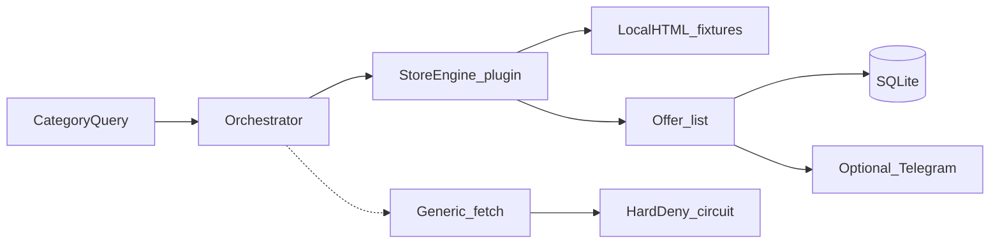

# Layout

## Modules

| File | What it does |
| --- | --- |
| `src/stores/base.py` | `StoreEngine` + `Offer` |
| `src/stores/example_mart.py` | fake store over `fixtures/html/` |
| `src/category_tracker.py` | run engines, optional DB write |
| `src/fetch.py` | gaps + hard-deny circuit; network off by default |
| `src/robots.py` | robots helper, fails closed if unread |
| `src/database.py` | tiny SQLite schema |
| `src/notifier.py` | optional Telegram |

## Kept from the private bot (generic form)

- hard-deny cool-down
- request gap
- fixture tests in CI
- secrets only via env

## Not published

Real store URL maps, CSS/XPath, ISP tables naming shops, browser challenge recipes, proxy vendor clients. See `NEVER_PUBLISH.md`.
